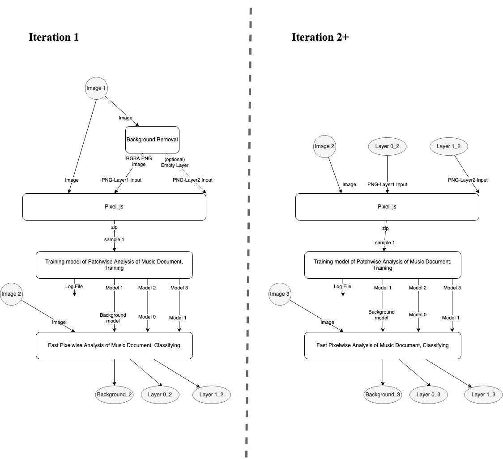
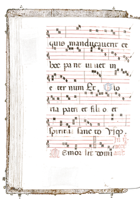

# Iterative Training with Paco Classifier

Correct manuscripts with `background removal` and `pixel`.
2. Train `paco classifier` with the manuscript you just corrected.
3. Let the trained `paco classifier` predict more manuscripts for you.
4. Correct predicted manuscripts. Repeat `1`~`3` until you get satisfying results (means the paco classifier is able to predict correctly).

---
## Iteration 1
### Background Removal.
This job use `Sauvola threshold` to remove background of a manuscript.

The reuslt looks like this:



* Job Name: `Background Removal`
* Category: `Background removal - remove image background`
* Input Port: 
  * `Image` of type `rgb+png`, `rgb+jpg`, `rgba+png`, `greyscale+png`, `onebit+png`.
* Output Port: 
  * `RGBA PNG image` of type `rgba+png`: the input `Image` with its background removed.
  * (Optional) `Empty Layer`: An empty layer ready to be used as the `PNG-Layer<i> Input` of the `Pixel_js` job.
* Settings:
    * `Background Removal Method`: A drop down menu to select the method to do background removal. Support using [Sauvola Threshold](https://scikit-image.org/docs/stable/auto_examples/segmentation/plot_niblack_sauvola.html) (no neural network) and [Selectional Auto-Encoder (SAE) binarize](https://github.com/ajgallego/document-image-binarization) (with neural network)
    * `window_size`: The `window_size` for Sauvola Threshold, see docs for [`skimage`](https://scikit-image.org/docs/stable/api/skimage.filters.html#skimage.filters.threshold_sauvola)
    * `k`: The `k` for Sauvola Threshold, see docs for [`skimage`](https://scikit-image.org/docs/stable/api/skimage.filters.html#skimage.filters.threshold_sauvola)
    * `contrast`: adjust contrast before using Sauvola Threshold with `img = img * (contrast/127+1) - contrast + brightness`
    * `brightness`:  adjust brightness before using Sauvola Threshold with `img = img * (contrast/127+1) - contrast + brightness`

### Pixel_js
```
Manually label a small regions!
```
Say we want two layers: `neumes` and `staff`, we need three input ports:
1. `Image`: this will be the manuscript you sent to the `Background Removal`.
2. `PNG-Layer1 Input`: this will be the output port (`RGBA PNG image`) of the `Background Removal` job.
3. `PNG-Layer2 Input`: this will be the *optional* output port `Empty Layer` of the `Background Removal` job. In pixel, this is simply an empty layer.

`Background Removal` just remove the background for you, which means that all the neumes and staff you care are still inside its output (`RGBA PNG image`). Say you want `neumes` in the first layer, `staff` in the second layer, in pixel, your task is to saperate move all the `staff` inside the pixel's first layer (`PNG-Layer1 Input`) to the second layer (`PNG-Layer2 Input`).

After labeling pixels inside a rgion, pixel automatically generate an additional background layer for you. All the outputs (`Image`, `generated background`, `labeled neumes`, `labeled staff`, `cropped region`) is packed to a `zip` file. We recommand not opening and modify the zip file.

This is the complete workflow of pixel
```
Before you do the saperation job by hand.
<PNG-Layer1 Input> contains <neumes> and <staff>.
<PNG-Layer2 Input> contains nothing. It's just an empty layer.

When working on pixel:
1. First you crop a region.
2. Second, go to <PNG-Layer1 Input>. Moving all the <staff> to <PNG-Layer2 Input>
3. You only have to work on the cropped region.

After your job:
<PNG-Layer1 Input> contains <neumes>.
<PNG-Layer2 Input> contains <staff>.

Then Pixel prepares a zip file for you that contains:
<Image>: The original manuscript.
<rgba PNG - Layer 0 (Background)>: This is the background that pixel generates for you.
<rgba PNG - Layer 1>: This layer is labelled by you. It contains <neumes>.
<rgba PNG - Layer 2>: This layer is labelled by you. It contains <staff>.
<rgba PNG - Selected regions>: The region you cropped.
```

### Training model of Patchwise Analysis of Music Document, Training
```
Train the classifier with data you just labeled!
```
* Job Name: `Training model of Patchwise Analysis of Music Document, Training`
* Category: `OMR - Layout analysis`
* Input Port: 
  * `Sample <i>` of type `application/zip`. This is the `zip` output from `Pixel_js`. You can add up to `20` input port.
* Output Port: 
  * `Log file`: A log file.
  * `Model <j>`: The trained `jth` model to predict the `jth` layer.

The number of output models equals to the number of input layers to `Pixel_js` + one additional background layer generated by `Pixel_js`!

```
Here we reuse the example workflow in <Pixel_js>. In the example we input two layers: <PNG-Layer1 Input> and <PNG-Layer2 Input>, and labeled them as <neumes> and <staff>.

Since #output models of <Training model of Patchwise Analysis of Music Document, Training> is #layers + 1. In this exmpale, #output will be 2+1=3. We get three trained models: one for background generated by <Pixel_js>, one for neumes, and one for staff.
```
### Training model of Patchwise Analysis of Music Document, Classifying
```
Use your trained model to classify more manuscripts!
```
* Job Name: `Fast Pixelwise Analysis of Music Document, Classifying`
* Category: `OMR - Layout analysis`
* Input Port: 
  * `Image`: This is the manuscript you want to classify.
  * `Background model`: The trained model to predict background.
  * `Model <i>`: The trained model to predict `ith` layer.
* Output Port: 
  * `Background`: The predicted backghround
  * `Layer <i>`: The predicted `ith` layer.

## Iteration 2+
The workflow `Training model of Patchwise Analysis of Music Document, Training` and `Fast Pixelwise Analysis of Music Document, Classifying` are the same. The only difference is the `Background Removal` and `Pixel_js`

Basically in `2+` iteration, we don't need `Background Removal` job anymore. The predicted layers, output `Layer<i>` from `Fast Pixelwise Analysis of Music Document, Classifying` of the last iteration, are the input layers (`PNG-Layer<i> Input`) to `Pixel_js`. We correct the predicted output from the trained model, and use the corrected results as the new training data.